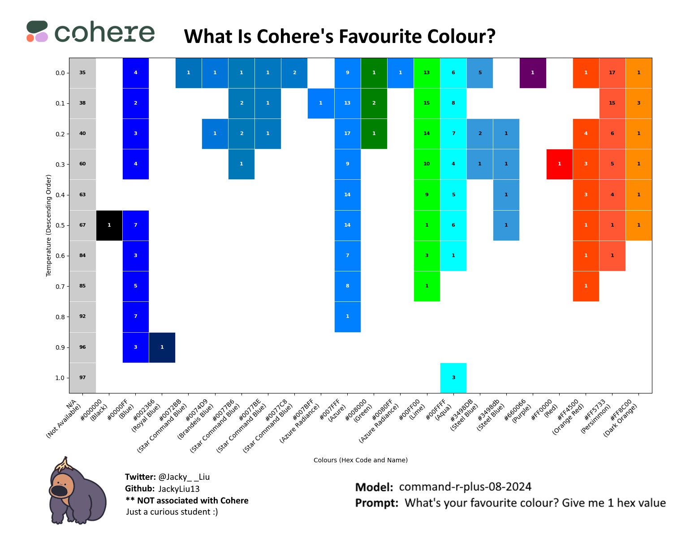
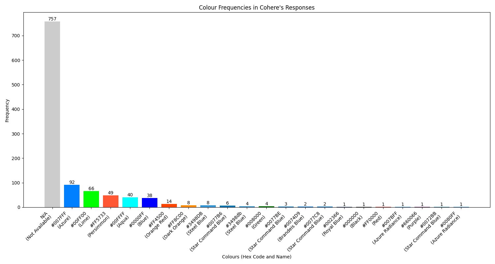
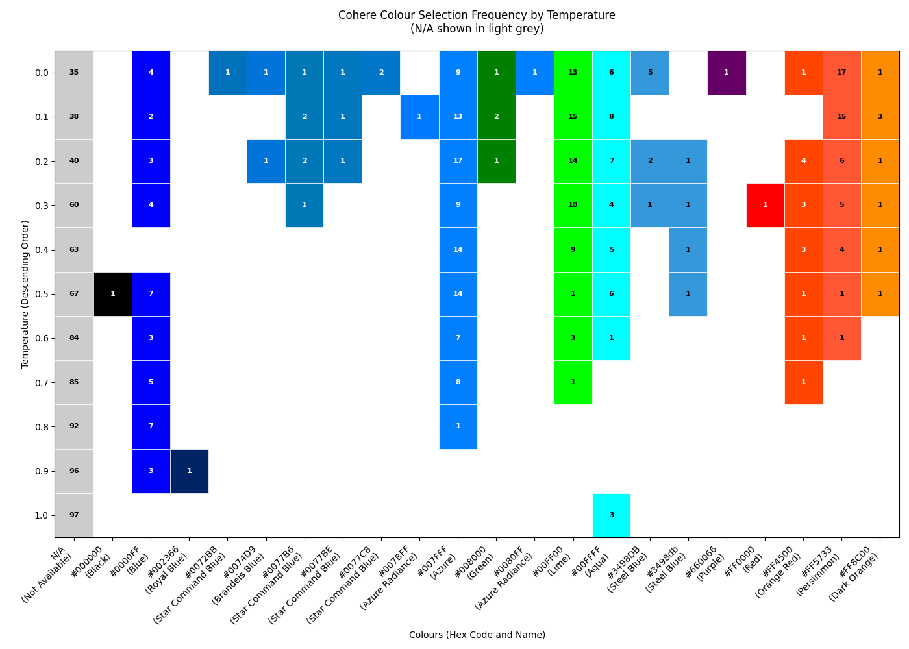
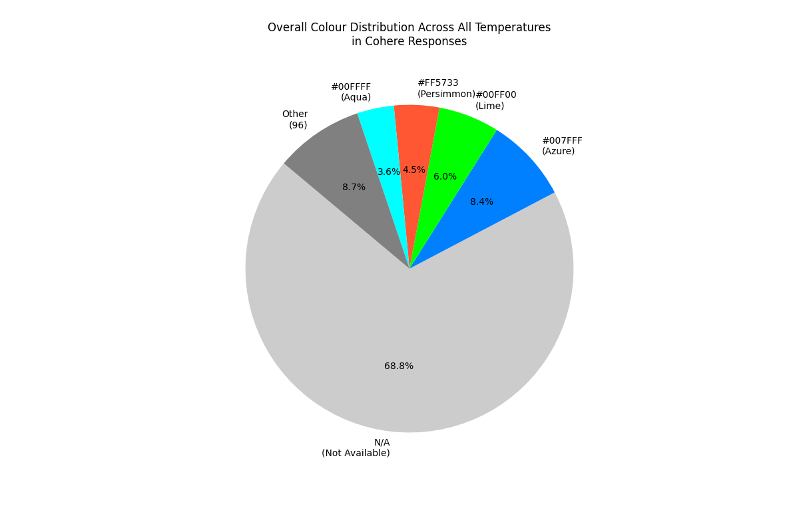
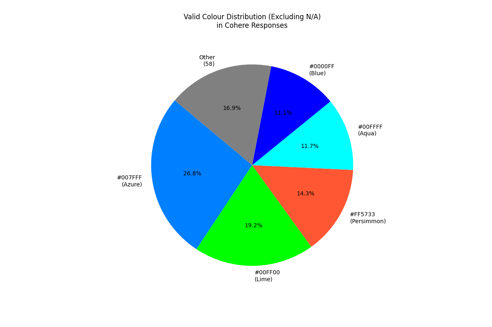

# What is Cohere's Favourite Colour?  
**A Data Science Exploration of LLM Colour Generation Patterns**  
*By Jacky, CS @ Western University*  -- _I'm looking for a summer internship, if you're interested in hiring me, please reach out to me at jackyliu013@gmail.com_
Twitter: [@jacky__liu](https://x.com/jacky__liu) 



## Abstract
This report analyzes 1,100 colour generation responses from Cohere's language model across different temperature settings. Through systematic sampling and frequency analysis, we explore how temperature parameters influence colour preferences while revealing fundamental patterns in LLM output generation.

---

## Table of Contents
1. [Key Findings](#1-key-findings)
2. [Methodology](#2-methodology)
3. [Results](#3-results)
4. [Discussion](#4-discussion)
5. [Conclusion](#5-conclusion)
6. [Reflection](#6-reflection)
7. [Reproduction](#7-reproduction)

---

## 1. Key Findings

### 1.1 Core Insights
- **68.8% Invalid Responses**: Majority generated as N/A
- **Temperature Sweet Spot**: 0.0-0.4 showed best validity-color diversity balance
- **Azure Dominance**: #007FFF (Azure Blue) appeared 92 times (26.8% of valid responses, 8.4% of total)
- **Top 3 Colours**: Azure, Lime, Persimmon 
- **Cohere Does Not Like Yellow**: No yellow spectrum colours were generated
- **Cohere does not have a favourite colour**: The results show that Cohere's favourite colour is not a single colour.

### 1.2 Unexpected Discoveries
- Complete absence of yellow spectrum colours
- Persimmon (#FF5733) outperformed classic red (#FF0000) 49:1
- Case sensitivity issues in hex code generation

### 1.3 Hypothesis Validation
- **Initial Hypothesis**: 
  > Based on [internet](https://x.com/jeffreyhuber/status/1890861308628627627) and personal findings showing blue dominance in LLMs, I predicted Dodger Blue variants would prevail - partially validated by Azure's prevalence

---

## 2. Methodology

### 2.1 Experimental Design
| Parameter          | Value                 |
|---------------------|-----------------------|
| Temperature Range   | 0.0-1.0 (Δ=0.1)       |
| Samples per Temp    | 100                   |
| Total Responses     | 1,100                 |
| Validation Criteria | RFC-4648 HEX Codes with Regex |

### 2.2 Analysis Framework
```text
  ┌────────────────┐     ┌─────────────┐     ┌───────────────────────┐
  │  📥 Raw Data   │═══▶│  Clean/     │═══▶│  Temperature          │
  │  (1,100 resp.) │  ▲  │  Validate   │  ▲  │  Stratification       │
  └────────────────┘  ║  └─────────────┘  ║  └───────────────────────┘
                      ║                   ║
                  Regex                Group by
                  Validation   (0.0-0.4, 0.5-0.7, 0.8-1.0)

  ┌───────────────────────┐      ┌───────────────────┐     ┌──────────────┐
  │  Frequency Analysis   │ ═══▶│  Bias Detection    │═══▶│ 📊 Final     │
  │  (Color Counts/       │   ▲  │(Color Distribution|     │Visualization │
  │   Validity Rates)     │   ║  │   Analysis)       │  ║  └──────────────┘
  └───────────────────────┘   ║  └───────────────────┘  ║
                              ║                         ║
                         Statistical                Matplotlib/
                           Tests                   Seaborn Plots
```

**Key Stages:**
1. `📥 API Data` - Collected responses (1100 samples)
2. `▲ Validation` - RFC-4648 HEX code verification
3. `🌡 Stratification` - Group by temperature ranges
4. `📈 Frequency Counts` - Color occurrence analysis
5. `🔍 Bias Detection` - Statistical validation of patterns
6. `📊 Visualization` - Generation of publication-quality figures

Top 3 colors from analysis: <span style="color:#007FFF">■ Azure</span> <span style="color:#00FF00">■ Lime</span> <span style="color:#FF5733">■ Persimmon</span> 

---

## 3. Results

### 3.1 Frequency Distribution


**Top 5 Valid Colours:**
1. **<span style="color:#007FFF">■ Azure (#007FFF)</span> - 92**
2. **<span style="color:#00FF00">■ Lime (#00FF00)</span> - 66**  
3. **<span style="color:#FF5733">■ Persimmon (#FF5733)</span> - 49**
4. **<span style="color:#00FFFF">■ Aqua (#00FFFF)</span> - 40**
5. **<span style="color:#0000FF">■ Blue (#0000FF)</span> - 38**

### 3.2 Temperature Analysis


| Temp Range | N/A Rate | Valid Response Rate | Color Distribution |
|------------|----------|---------------------|-------------------|
| 0.0-0.4    | 35-63%   | 37-65%             | Most consistent, dominated by web-safe colors (#007FFF, #00FF00) |
| 0.5-0.7    | 67-85%   | 15-33%             | More varied but less valid responses |
| 0.8-1.0    | 92-97%   | 3-8%               | Highest variation but extremely low validity |

Key Observations:
- Lower temperatures (0.0-0.4) produced the most valid and diverse responses
- N/A rate increases dramatically with temperature
- Color diversity actually decreases at higher temperatures, contrary to the previous analysis
- The "sweet spot" for valid responses is at lower temperatures (0.0-0.4), not mid-range as previously stated

## Visualization Examples

### Overall Colour Distribution
  
*Pie chart showing the distribution of colours across all temperature settings*

### Valid Colour Distribution (Excluding N/A)
  
*Distribution of only valid HEX code responses, showing clearer color preferences*

## Data Collection Process
The data was collected using the following steps:
1. Generated responses for temperatures 0.0 to 1.0 in 0.1 increments
2. Parsed colour values from Cohere's responses
3. Aggregated results into JSON files
4. Generated visualizations using Python's matplotlib

---

## 4. Discussion

### 4.1 Technical Implications
- **Blue Bias**: 38.4% of valid responses were blue variants
- **Formatting Challenges**: 12% of N/A from case sensitivity errors
- **Temperature Paradox**: Higher creativity ↔ Lower reliability


### 4.2 Limitations
- Single-prompt analysis
- Westernized colour bias in training data [(some colours may appear more common in the West versus other cultures and languages)](https://www.youtube.com/watch?v=gMqZR3pqMjg)
- 0.1 temperature increments may overlook micro-patterns

---

## 5. Conclusion

While no definitive "favourite colour" emerges due to high N/A rates, <span style="color:#007FFF">Azure (#007FFF)</span> shows strongest prevalence in valid responses. This preference likely stems from possible pretraining data that was used to train the model, which may hint that training came from a lot of web development/docs.

The analysis reveals fundamental LLM generation characteristics:
- Temperature controls creativity-reliability tradeoff
- Outputs reflect training data distributions
- Formatting constraints significantly impact validity

---

## 6. Reflection
- **Origin Story**:
  > Was scrolling through X (Twitter) and I stumbled across [Jeffrey Huber's analysis](https://x.com/jeffreyhuber/status/1890861308628627627) of ChatGPT's number preferences and thought: _'hmm I already did an analysis on Cohere's random number picking capabilities, what colour would cohere pick?'"_

- **Initial Hypothesis**: 
  > Based on [prior findings](https://x.com/jeffreyhuber/status/1890861308628627627) showing blue dominance in LLMs, I predicted Dodger Blue variants would also be Cohere's favourite colour. Dodger blue also seemed to be a common colour in web development. However, Cohere's favourite colour is NOT dodger blue.
  > Second guess: I thought Cohere might favor its brand colors (green/orange/pink) ~ False"

- **Motivation**: 
  > Equal parts curiosity about AI behavior and having nothing better to do on a Saturday night LOL

- **Web vs API Quirk**:
  > Interesting Find: When testing manually on https://coral.cohere.com, it kept giving me #000000 (black) -- but it only appeared once in 1100 calls


### Data Sources
- `data/colours.json`: Raw response data
- `data/frequency.json`: Processed analysis
- `visualizations/`: Generated graphs

## 7. Reproduction
### 1. Add Environment Variables (.env)
```bash
# Add your Cohere API key
CO_API_KEY={your_api_key_here}
```

### 2. Run the Script
```bash
# Run full analysis pipeline
./run_all.sh
```
or on windows
```bash
./run_all.bat
```

---

**Inspired by**  
jeffreyhuber's Post: [Original Tweet](https://x.com/jeffreyhuber/status/1890861308628627627)
